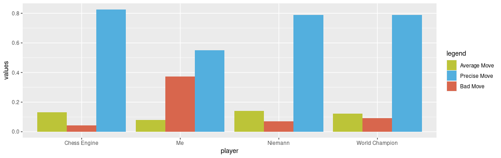

# Catching a Chess Cheater Using R and GridDB
## Introduction
Chess is an ancient game played by millions of people everyday. Chess, like many other games, has seen a boom with the enhancement of technology due various playing platforms giving players the chance to interact, learn, and exchange ideas with one another. Nonetheless, the most drastic improvement chess has seen over the last couple of decades is the introduction of the artificial intelligence based models which have become so good that even the best player in the world cannot compete with them. However, there are two sides to every coin, and in this case computers have given impostors the ability to cheat while playing other humans causing issues of fair play in many online chess tournaments. So, is there anyway cheating can be detected and if so what are the methods to catch a cheater? In the following sections, we will explore how to build a simple algorithm for detecting **blatant** cheating.\
Before we start with the analysis, let’s firstly start by understanding some chess terminology. Firstly, a **centipawn** value is a numeric value that a chess engine uses to evaluate a chess position. The standard is that the simplest piece such as the pawn is considered to be worth 100 cp. Similarly, the queen which is the most valuable piece is worth 900 cp.\
Secondly, the **Elo rating** is a metric used in chess to assign each chess player a strength score. For simplicity reasons, one can think of the Elo score as a relative score to the rest of the players in the field and that the higher the value, the better the player is.\
Thirdly, a method that can be used to measure the accuracy of a person’s moves is the **centipawn loss**. This is a strategy to assess how bad a player’s moves were compared to the ones suggested by chess engines. Further, the most commonly used methodology is to compute the average centipawn loss which means how much the player deviated from the actual engine’s best recommendation.\
Mathematically, it can be defined as follows:
$$acl =\frac{ \sum\limits_{i=1}^{n} |x - x_i|}{n}$$ 


where $x$ is the evaluation after following the engine’s move whereas $x_i$ is the actual evaluation after player made a move.\
Lastly, we need to define some assumptions before starting the analysis. If a player has an average loss of $0$, then the player has followed the moves as suggested by the engine 100% of the time. Hence, the larger the loss the weaker the player is. For this example, we will consider an average value lower than $15$ as cheating. 

## Analysis
To follow along all you need to do is to install [R](https://cran.r-project.org/) and [Stockfish](https://stockfishchess.org/download/) on your computer. I am using R version 4.2.2 and Stockfish version 14.1. However, other versions should be working fine. The complete code for this project can be found in [this repository](https://github.com/KryeKuzhinieri/Catching-a-Chess-Cheater-Using-R-and-GridDB). Next, load the necessary R packages

```r
library(dplyr)
library(magrittr)
library(stringr)
library(bigchess)
library(RJDBC)
```

Since the process of engine calculation takes some time, it is always better to store the results in the database so that we won’t need to rerun the algorithm all the time. Besides this, we can build our own chess game database where we can keep information about the games we played. We will be using [GridDB](https://docs.griddb.net/gettingstarted/using-apt/) because it is lightweight and fast. I am using version 5.0.0 for this tutorial. Moreover, we are using gridstore-jdbc-5.1.0 as the driver for RJDBC which can be downloaded by clicking [here](https://search.maven.org/search?q=a:gridstore-jdbc). To connect to the database, we use the following R code

```r
driver <- JDBC(
  driverClass = "com.toshiba.mwcloud.gs.sql.Driver",
  classPath = "/usr/share/java/gridstore-jdbc-5.1.0.jar"
)
conn <- dbConnect(driver, "jdbc:gs://127.0.0.1:20001/myCluster/public", "admin", "admin")
```

Chess games are usually stored in a .pgn format where they store all the moves each player makes with extra information such as the rating of the players, piece colors, and more. We will be using only 4 pgn games in this project, but you can download large chess datasets for active and inactive players in [this website](https://www.pgnmentor.com/files.html). Besides, it only requires that you place the data in the *Data* folder and by running the *cheat_detector.R* script all of the statistics and the rest of the pgn information for your large chess database will be calculated. Let's simplify the tutorial by only taking one match called *normal_game.pgn*.
To read the data we can utilize the package called `bigchess`.

```r
game <- read.pgn(con = file("normal_game.pgn"), stat.moves = F, extract.moves = 0)
> str(game)
'data.frame':   1 obs. of  9 variables:
 $ Event   : chr "Rated Blitz game"
 $ Site    : chr "https://lichess.org/kOMi8fle"
 $ Date    : chr "2022.10.21"
 $ Round   : chr NA
 $ White   : chr "Krye_Kuzhinieri"
 $ Black   : chr "D1stknightmaster"
 $ Result  : Ord.factor w/ 1 level "1-0": 1
 $ Movetext: chr "1. e4 e5 2. g3 Nc6 3. Bg2 Bc5 4. Ne2 Nf6 5. O-O d6 6. c3 Bg4 7. d3 h6 8. Qc2 O-O 9. Nd2 Ne7 10. Nf3 c6 11. d4 B"| __truncated__
 $ NMoves  : num 51
```

Moreover, chess games use various notations to write the moves. But Stockfish accepts only the Long Algebraic Notation (LAN) so we need to convert the string.

```r
game_lan <- san2lan(game$Movetext[1])
> game_lan
[1] "e2e4 e7e5 g2g3 b8c6 f1g2 f8c5 g1e2 g8f6 e1g1 d7d6 c2c3 c8g4 d2d3 h7h6 d1c2 e8g8 b1d2 c6e7 d2f3 c7c6 
d3d4 g4f3 g2f3 c5b6 c1e3 e7g6 a1d1 d8c8 a2a4 a7a5 c3c4 f8e8 d4d5 b6e3 f2e3 c6d5 e4d5 e5e4 f3g2 f6g4 c2c3 
c8c5 e2d4 a8c8 b2b3 c5b4 c3b4 a5b4 d1e1 e8e5 d4b5 c8d8 h2h3 g4f6 b5d4 g6e7 g3g4 h6h5 d4f5 e7f5 f1f5 h5g4 
f5e5 d6e5 h3g4 f6g4 g2e4 g7g6 g1g2 f7f5 e4f3 g4f6 e1h1 g8g7 g2f2 e5e4 f3e2 b7b6 h1d1 g6g5 d5d6 f5f4 e3f4 
g5f4 d1d4 f4f3 e2f1 g7f7 f1h3 f7g6 a4a5 b6a5 c4c5 f6e8 d6d7 e8c7 c5c6 g6g5 d4e4 c7d5 e4d4"
```

Next, let's calculate the average centipawn loss by getting the score of each value after a move. For instance, after white makes a move, we get the evaluation of the engine and we store the value. In essence, different engine depths return different evaluations; that is, the higher the engine depth the more accurate is the evaluation provided by Stockfish. Here we are using engine_depth of 20.

```r
all_moves <- str_split(lan, " ")[[1]]
for (i in seq_along(all_moves)) {
    notation <- trimws(paste(notation, all_moves[i]), which = "left")
    score <- uci_engine(engine_path) %>%
      uci_position(moves = notation) %>%
      uci_go(depth = engine_depth) %>%
      uci_quit() %>%
      uci_parse(filter = "score")

    score <- score * (-1)
    if (i %% 2 == 0) {
      black_scores <- c(black_scores, score)
    } else {
      white_scores <- c(white_scores, score)
    }
  }

```

After calculating the scores, we need to take the difference of each move. For example, we get the difference between the evaluation before and after white made a move. This will give us the loss.

```r
black_difference = white_scores + black_scores
white_difference = white_scores + dplyr::lag(black_scores)
```

Although very rarely, we can still get positive values due to engine not taking all possibilities into account. We will convert values larger than zero, meaning the values where the person outperformed the engine, as zero for simplification.

```r
white_difference = ifelse(white_difference > 0 | is.na(white_difference), 0, white_difference),
black_difference = ifelse(black_difference > 0 | is.na(black_difference), 0, black_difference)
```

Lastly, we want to get the percentage of best moves for each player. To do that, we can split the data into cuts by specifying the desired ranges. For this tutorial, we will call a move which is in range 0-25 as precise, 25-75 as average, and more than 75 as a bad move.

```r
limit_ranges = c(0, 25, 75, Inf)
limit_names = c("Precise Move", "Average Move", "Bad Move")
white_cuts = cut(white_difference * -1, breaks = limit_ranges, include.lowest = T, labels = limit_names)
black_cuts = cut(black_difference * -1, breaks = limit_ranges, include.lowest = T, labels = limit_names)
```

Then, the percentages and the loss can be calculated as follows:

```r
# Percentages
white_percentages <- prop.table(table(game_results$white_cuts))
black_percentages <- prop.table(table(game_results$black_cuts))

# Loss
white_average_cp <- abs(mean(game_results$white_difference))
black_average_cp <- abs(mean(game_results$black_difference))
```

## Results
The analysis above has completed successfully and now we have a chess database in our hands. By running `SELECT * FROM chess_table_depth_20` you can get various information for each of the games played. Among others, the database stores information such as: event name, location where games were played, date, round, player names, and the centipawn statistics for each player. Here is sample of our database

|Event                                               |Site                        |Date      |Round|White          |Black             |Result|Movetext                                      |NMoves|white_stats                |black_stats                     |white_average_cp|black_average_cp|
|----------------------------------------------------|----------------------------|----------|-----|---------------|------------------|------|----------------------------------------------|------|---------------------------|--------------------------------|----------------|----------------|
|Champions Chess Tour Opera Euro Rapid - Prelims 2021|Chess.com                   |2021.02.07|10   |Carlsen, Magnus|Nakamura, Hikaru  |1-0   |1. d4 Nf6 2. c4 e6...                         |33    |c(`Precise Move` = 0.7...  |c(`Precise Move` = 0....        |19.3030303030303|31.2727272727273|
|Sinquefield Cup 2022                                |Chess.com                   |2022.09.04|03   |Carlsen, Magnus|Niemann, Hans Moke|0-1   |1. d4 Nf6 2. c4 e6 3. Nc3 Bb4 4. g3 O-O 5.... |57    |c(`Precise Move` = 0.6.... |c(`Precise Move` = 0.7894736....|28.0175438596491|20.4736842105263|
|Rated Blitz game                                    |https://lichess.org/kOMi8fle|2022.10.21|NA   |Krye_Kuzhinieri|D1stknightmaster  |1-0   |1. e4 e5 2. g3 Nc6 3...                       |51    |c(`Precise Move` = 0.54....|c(`Precise Move` = 0.....       |213.039215686275|223.56862745098 |
|Casual Correspondence game                          |https://lichess.org/gwhvMXUI|2022.10.25|NA   |Krye_Kuzhinieri|lichess AI level 8|0-1   |1. e4 e5 2....                                |23    |c(`Precise Move` = 0.52....|c(`Precise Move` = 0.826....    |61.0434782608696|13              |


Now, let's crunch the data and test the performance of our model. The following is a game I played online on Lichess. I know that I and my opponent haven't cheated and we can use this to test our model. 

<iframe src="https://lichess.org/embed/game/kOMi8fle?theme=auto&bg=auto" width=600 height=397 frameborder=0></iframe>

We can filter the data score by fetching the game from GridDB by running `SELECT * FROM chess_table_depth_20 WHERE Black == 'D1stknightmaster'`. This yields the following results:

| Player      | Precise Move | Average Move | Bad Move | Average Loss
| ----------- | ----------- | ----------- | ----------- | ----------- |
| White      | 55%       | 8%|  37% | <span style="color:green">**213.0**</span> |
| Black   | 43%        | 26% | 31%| <span style="color:green">**223.5**</span>|

The second game is a game played between two of the strongest chess players in the world in the Championship Chess Tour Opera Euro Rapid tournament. We know that nobody cheated in this game but we want to know what is the average centipawn loss of the chess elite.

<iframe src="https://lichess.org/embed/game/1gIiW0OQ?theme=auto&bg=auto#65" width=600 height=397 frameborder=0></iframe>

We can filter the data by running the following query `SELECT * FROM chess_table_depth_20 WHERE Black == 'Nakamura, Hikaru'` from where we get the following scores:

| Player      | Precise Move | Average Move | Bad Move | Average Loss
| ----------- | ----------- | ----------- | ----------- | ----------- |
| White      | 79%       | 12%|  9% | <span style="color:green">**19.30**</span> |
| Black   | 79%        | 12% | 9%| <span style="color:green">**31.27**</span>|


The next match is a game where I played against the computer. In this case we want to detect that black cheated. So, we expect a very low **acl**.

<iframe src="https://lichess.org/embed/game/gwhvMXUI?theme=auto&bg=auto" width=600 height=397 frameborder=0></iframe>

We filter the data by running `SELECT * FROM chess_table_depth_20 WHERE Black == 'lichess AI level 8'`. The results are:

| Player      | Precise Move | Average Move | Bad Move | Average Loss
| ----------- | ----------- | ----------- | ----------- | ----------- |
| White      | 52%       | 22%|  26% | <span style="color:green">**61.04**</span>|
| Black   | 83%        | 13% | 4%| <span style="color:red">**13.00**</span>|

Here we can clearly observe that the player using black pieces has cheated since the value of the loss is smaller than the one we set to be acceptable.

The last game I want to analyze together is the infamous one between world champion Mangus Carlsen and the young American prodigy Hans Niemann. This game is in particular significant because Carlsen accused Niemann of cheating. Although a lot has been said on the topic, this [report](https://www.chess.com/blog/CHESScom/hans-niemann-report) by Chess.com does not believe Hans cheated in this very game. However, since we have build our model, let's test it. We filter the data by running `SELECT * FROM chess_table_depth_20 WHERE Black == 'Niemann, Hans Moke'`. 

<iframe src="https://lichess.org/embed/game/jMaLMDvn?theme=auto&bg=auto"
width=600 height=397 frameborder=0></iframe>

| Player      | Precise Move | Average Move | Bad Move | Average Loss
| ----------- | ----------- | ----------- | ----------- | ----------- |
| White      | 65%       | 23%|  12% | <span style="color:green">**28.01**</span>|
| Black   | 79%        | 14% | 7%| <span style="color:green">**20.47**</span>|

Hence, it can be argued that Carlsen did not have a good day overall and that Niemann's performance was not extraordinary. However, this technique does not work well with selective cheating. To improve this model, you can find some useful ideas in the concluding part of this article.

Lastly, I want to display how all players compare to one another. Below you can see that the engine clearly outperforms the world champion. However, the biggest difference is not in the fact that it plays always the best moves, but how rarely a simple online engine makes a mistake. Moreover, an amateur player like myself does on average play a bad move 40% of the time.


## Conclusion
In this article we focused on detecting blatant cheating in chess. Although the statistical model we created is simple, it achieves good results in cases where players follow most of the engine moves. However, this model does not work well for selective or smart cheating because a good player does not need to copy all the engine moves but a couple of them in critical moments. The following can be done to improve the model:
* Create groups of **acl** scores for different buckets, i.e: 2000-2100, 2100-2200,..., and compare similar players.
* Create player's **acl** scores over multiple games and compare to observe anomalies.
* Optimize **acl** threshold levels. We used 15 in this experiment, but the values can change. A smaller value catches a cheater with higher confidence, whereas a larger value could cause false positives (accusing a person for cheating when in fact they did not)

To conclude, enjoy competing with others using your own strength and avoid cheating because you cannot run away from statistics :). 

